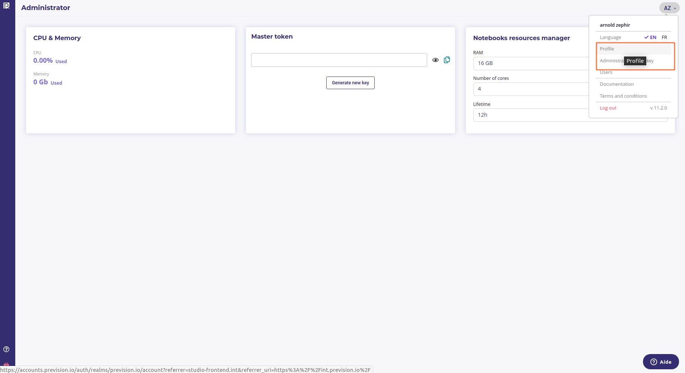
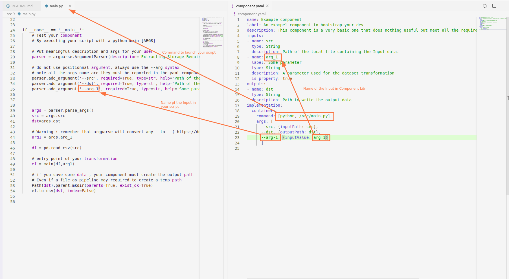

# Component Tutorial

## Why am I here ?

You want to create a custom component to be use in a Prevision.io 
pipeline.  

A custom component is a piece of code mostly use for transforming dataset.

## General setup

In order to build a component and use it as a custom component in a pipeline, you need 3 files :

- A Dockerfile
- A yaml description file
- A python src code with arguments

Note that only the Dockerfile and yaml file are mandatory.

A default Dockerfile is provided and you do not need to modify it for simple component. For more complex components, with many modules, you could have to.

## What you going to do ?

Building a custom component implies 6 steps : 

- Setup the env
- Write a script with arguments
- Test it locally
- Write the associated yaml file
- Upload your project to a gitlab or github repo
- Install it into your pipeline component library from your repo


### Requirement

* You need a gitlab or github account to install your own component 
* You need to set it up in your profile page ( under the "Federated Identity" tab)




## Process

Note that most of the component process is the same that [kubeflow components](https://www.kubeflow.org/docs/components/pipelines/sdk/component-development/)

### Setup the env

Clone this repo :

```
git clone  https://github.com/previsionio/prevision-component-template.git my-component
cd my-component
```

Be sure to keep an isolated environment in order in order to not forget any dependencies

```
python3 -m venv env
source env/bin/activate
pip install -r requirements.txt
```

You need a requirements.txt file to list all your python modules. A default one is provided 

**All components must always have a requirements.txt file even if there is no requirements. If you have no requirements, update the Dockerfile to remove the install phase :**

`RUN python -m pip install -r /requirements.txt`

**or create an empty one if your component does not have requirements**

Then test that requirements meet your needs :

```
python src/main.py
```

### Write the script

When your is ready, you can write your script in main.py. You can change the name of this script but then you need to update it in the component.yaml file 

Your script must use args as input ( see [this excellent tutorial about Command Line Interfaces](https://realpython.com/command-line-interfaces-python-argparse/)) then each arguments of your script has to be written down in the component.yaml.

### Test your script

There is two test to run before commiting your work.

First check that using your code in commande line works with some data :

```
python src/main.py -arg-1 value1 --src ~/Documents/Dataset/Tabular/data.csv  --dst  output/resultat.csv
```

Check that the command you used for test ( `python src/main.py` ) is the one provided in the yaml file and check the name of your args and the mandatory one

```
implementation:
  container:
    command: [python, /src/main.py]
    args: [
      --src, {inputPath: src},
      --dst, {outputPath: dst}, 
      --arg-1, {inputValue: arg_1}
      ]
``` 

All arguments of your scripts must be in the implementation section of the component.yaml AND they must be mapped with the inputs section.

The inputs section is what the user gonna see when using your component and the implementation section is the way you components is going to be ran when used in a scheduled pipeline.


If you are a power user you can [install Docker](https://docs.docker.com/engine/install/ubuntu/) and you can check that your Dockerfile is ok with the following command

```sh
docker build -t my-component .
docker images
docker run -d  my-component
```

Check that some basic  command line allow to run your transformation on test data :

### List your args in the yaml file

A component.yaml file is provided for example.

The yaml file should reflect how to use your script :
- how to run it : implementation -> container -> command
- how to pass the parameters :  implementation -> container -> command
- how to map the parameters :  implementation -> container -> args

The `name`, `label` and `description` are  what your user will see in the component library.

The `inputs` are the description of your variable.



The `implementation` fields is how the script will be run. The `args` subfield is how to map the user parameter to your script args. It's a list of element separated by `,`. The command will be composed by inlining them (and replacing those in {} by the corresponding input)

`--args-name, {type: input_name},`


- args-name : the name of the args parsed by your scripts
- type :  one of `inputPath, outputPath, inputValue`. 
  - inputValue will be used in the UX as a user defined parameter. 
  - inputPath is the the mapping of node input to argument name. For example ` --src, {inputPath: src}` means that the input of your node will be mapped to the `src` argument
  - outputPath is the mapping of your output

inputPath and outputPath will be auto filled by the Scheduler when a pipeline Template is ran.


### Optionnal : write your Dockerfile

A default Dockerfile is provided. It works in most of case but you're free to adapt it.

### Commit and push your component

Commit all your work and push it to your git repo ( github or gitlab ). Note the name of the repo and the branch will be asked when installing the component in your Prevision library.

### Install it in your account

Go to your prevision account :

- pipelines > pipeline Components > New Pipeline Components

And input your repo information.

If everything is ok, the component status will be list as `done` in about 5 minutes.

Note that the component is not ran when installed. It only checks that the dockerFile works fine and all parameters in component.yaml are fine.

The component will be be ran only when a pipeline template using the component is scheduled to run.

## Trouble shooting

If the status is not done after a few minutes ( ~10mn ) something went wrong ( except if you got a lot of module to install and setup in your Dockerfile )

- check that your variable name in the yaml file and the argparser in python source code are the same.
- check your hyphen and underscore ('-' and '_') in input name and arguments name
- check that all file are at the right place and that the command in the yaml file use the path built in the dockerfile 

```
# in yaml file
command: [python, /src/main.py]
```

must use the same path than 

```
COPY requirements.txt /requirements.txt
RUN python -m pip install -r /requirements.txt

COPY . /
```
- you cannot use positionnal parameters in args. Check that your script does not require positionnal argument.
- IMPORTANT : if your component save a file ( output path ), it must create the directory structure. For example :

```
Path(args.output_dataset_path).parent.mkdir(parents=True, exist_ok=True)
df.to_csv(args.output_dataset_path, index=False)
```

If the components failed while executed, a log is provided in the "Schedule run" section, for each component unn the pipeline.